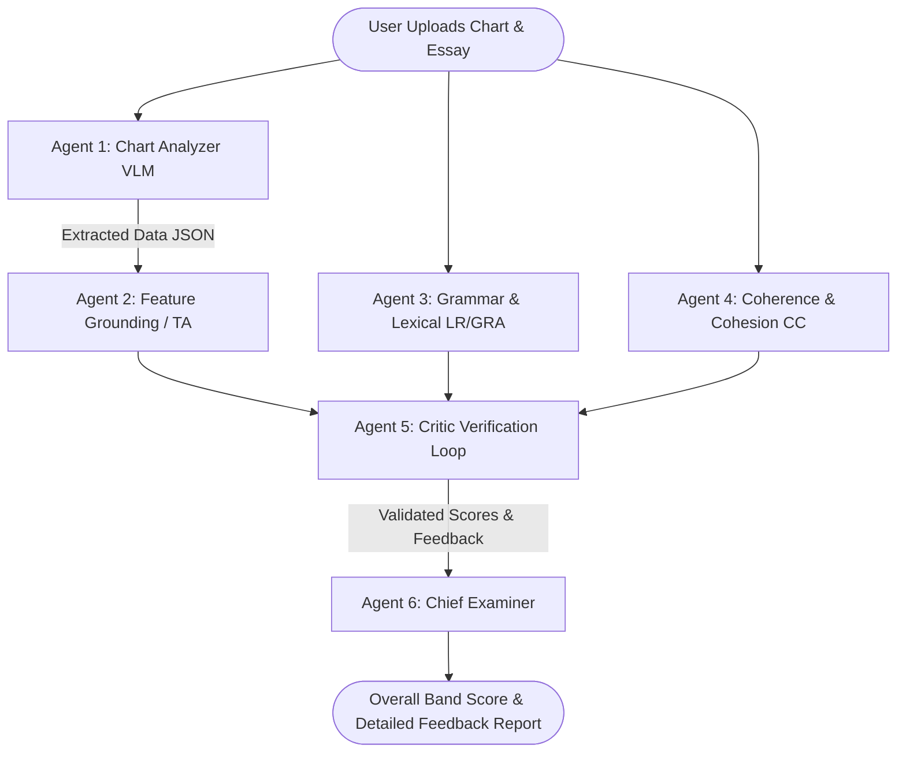

# 🎯 Multi-Agent Multimodal IELTS Task 1 Automated Scoring & Feedback System


An intelligent, multi-agent AI system designed to automatically grade **IELTS Writing Task 1** essays from chart images (bar charts, line graphs, pie charts, tables) and candidate essay responses. The system emulates professional IELTS examiners across all 4 official assessment criteria: **Task Achievement (TA)**, **Coherence & Cohesion (CC)**, **Lexical Resource (LR)**, and **Grammatical Range & Accuracy (GRA)**.

---

## 🌟 Key Features

* **👁️ Multimodal Chart Perception:** Leverages **Gemini Vision LLM** to analyze uploaded chart images, extracting key metrics, data trends, and data points into structured JSON metadata.
* **🤖 Multi-Agent Orchestration:** Powered by **LangGraph**, delegating specialized tasks to separate AI agents working in tandem.
* **🔬 Hybrid Rule-Based & Statistical NLP:**
  * **spaCy:** Syntactic sentence parsing, clause complexity analysis, and structural diversity scoring.
  * **LanguageTool:** Rule-based grammar, spelling, and punctuation error identification.
  * **SentenceTransformers:** Semantic coherence, paragraph flow, and cohesive device tracking.
* **🛡️ Critic-Refinement Verification Loop:** Evaluates individual sub-scores for halluncinations, inconsistencies, or score conflicts before final band synthesis.
* **📊 Interactive Diagnostic UI:** Built with **Streamlit** & **Plotly**, presenting real-time band scores, rubric radar charts, error highlights, and actionable sentence-level rewrites.

---

## 🏗️ System Architecture



---

## 🛠️ Tech Stack

* **Framework & Workflow:** `LangGraph`, `LangChain`
* **Large Language & Vision Models:** `Google Gemini API` (`google-genai`)
* **Natural Language Processing:** `spaCy`, `LanguageTool`, `SentenceTransformers`
* **Frontend UI & Visualization:** `Streamlit`, `Plotly`, `Pillow`
* **Testing & Quality Assurance:** `Pytest`, `Pydantic`

---

## 🚀 Quick Start & Installation

### Prerequisites
* Python 3.10+
* Java 17+ (Required for `LanguageTool` local grammar checks)
* A valid **Google Gemini API Key**

### 1. Clone the Repository
```bash
git clone https://github.com/USERNAME/REPO_NAME.git
cd "IELTS Writing Part 1 Scoring/ielts-grader-agent"
```

### 2. Set Up Environment & Install Dependencies
```bash
# Create virtual environment
python -m venv venv

# Activate virtual environment (Windows)
.\venv\Scripts\activate

# Activate virtual environment (Mac/Linux)
# source venv/bin/activate

# Install required packages
pip install -r requirements.txt

# Download spaCy English model
python -m spacy download en_core_web_sm
```

### 3. Configure Environment Variables
Copy `.env.example` to `.env` and add your Gemini API key:
```bash
cp .env.example .env
```
Edit `.env`:
```env
GEMINI_API_KEY=your_gemini_api_key_here
```

### 4. Run the Application
```bash
python run.py
```
Open your browser at `http://localhost:8501`.

---

## 🧪 Testing

Run automated pytest verification suites:
```bash
pytest -q
```

---

## 📄 License
This project is open source and available under the [MIT License](LICENSE).
